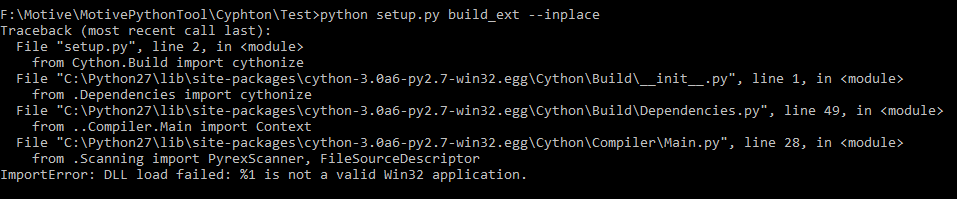

Python 2
==========

This is a fork of Python 2 that can be built with Microsoft Visual Studio 2015.
This is needed if your project uses Python 2 and any C99/C++11 libraries that
require a modern compiler.

The python test suite passes on Windows, Linux and macOS for this fork.
For background, see http://bugs.python.org/issue25759

Original Repo: https://github.com/kovidgoyal/cpython

This fork contains a step-by-step guide on how to build .pyd
file for Maya 2018 using Cython.

Requirements
------
Maya 2018

Visual Studio 2015 and Visual C++ 2015

Microsoft Visual C++ Compiler for Python 2.7

Git

Install
------
1. Download the source code from this repo and extract.
2. Find in the extracted folder `..\cpython\PCBuild\pcbuild.sln`, and open it
with Visual Studio 2015. Accept the suggested upgrades, and then close Visual Studio 2015 after it's done.
3. Using cmd, go into the folder `..\cpython\PCBuild\`, and run
`build.bat -e -p x64`. This will build Python 2.7 with MSVC1900, which corresponds to the 
Python interpreter that Maya 2018 uses.
4. After it's done, you will find `python.exe` in the `..\cpython\PCBuild\` folder or in one of the subfolders. Add the directory which contains
`python.exe` to the environment variable `PATH`.
5. Restart the command prompt, and type `python` to check if MSVC version is 1900. If not, something has gone wrong in the previous steps.
6. Install `pip`, you may be required to install it using an official release version of python.
7. Install `Cython`.
8. Attempt to build your .py file into .pyd. During this process, you may encounter several errors
indicating "ImportError: DLL load failed: %1 is not a valid Win32 application". Find in the last line which import is
causing this problem, go to that folder, and delete the corresponding .pyd file. For example,

Here, you would go to `..\Cython\Compiler\` and find Scanning.pyd, and delete it.
Repeat this step until no errors are reported, and you will have a .pyd file compiled successfully.

